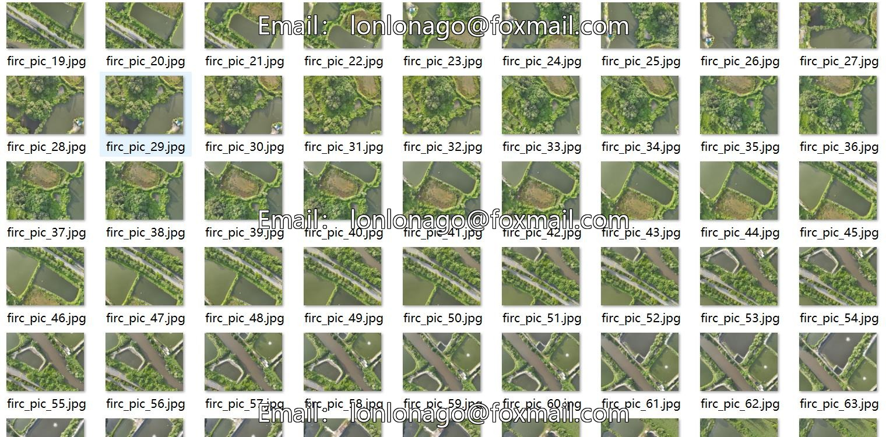
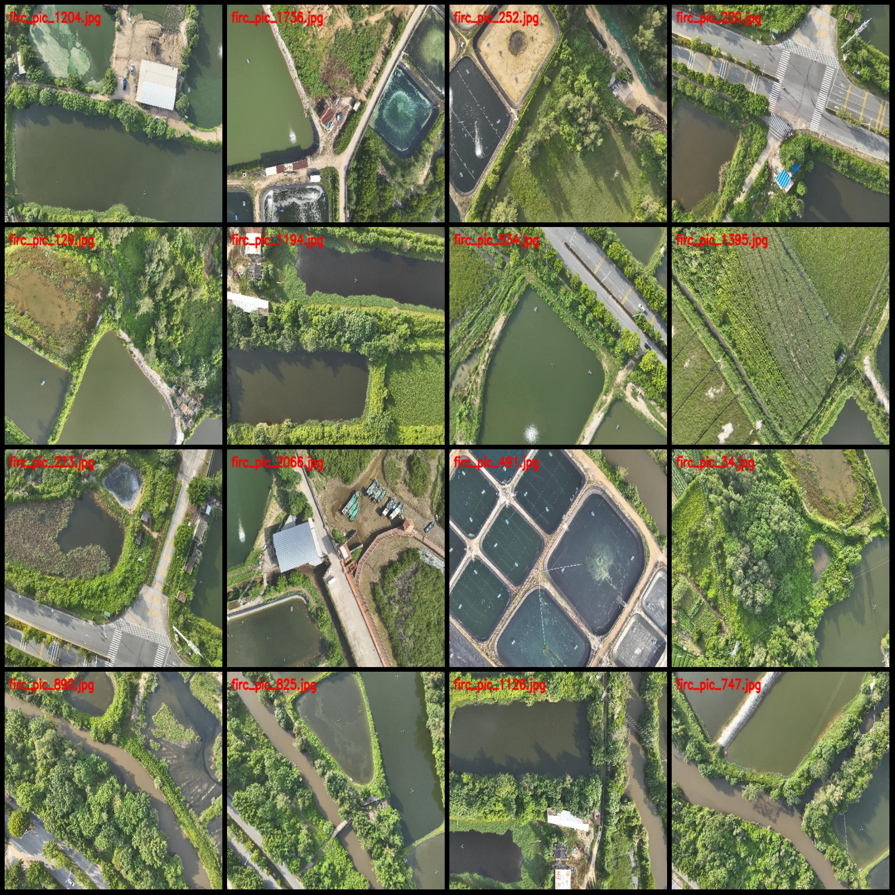
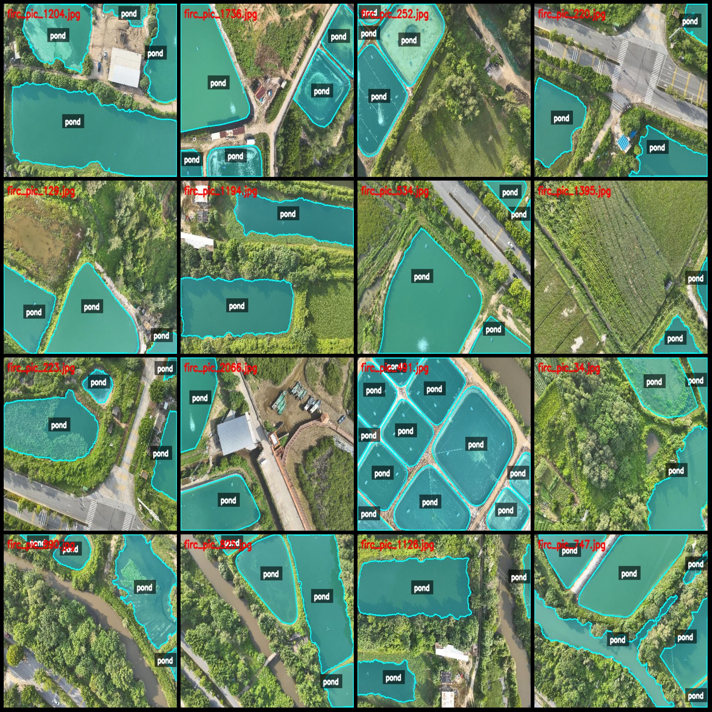
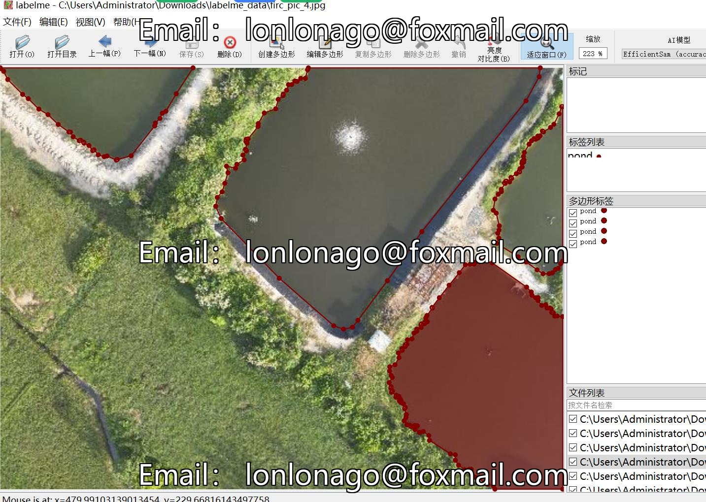

# Drone Viewpoint Aerial Photo Spot of Interest Identification and Segmentation Dataset in LabelMe Format

## Description

This dataset provides high-resolution drone-viewpoint (UAV) aerial photographs specifically designed for **Spot of Interest (SoI) identification and segmentation** tasks. Captured from low-altitude drone flights over rural and agricultural landscapes, the images contain diverse scene types including aquaculture ponds, farmland plots, rivers, waterways, roads, buildings, and vegetation areas.

Each image is annotated in **LabelMe (.json)** format with precise polygon masks for spots of interest, making it suitable for training and evaluating semantic segmentation, instance detection, and object detection models in remote sensing and aerial imagery domains.

## Dataset Details

- **Source**: UAV/drone aerial photography
- **Annotation Format**: LabelMe (.json) with polygon masks
- **Scene Types**: Aquaculture ponds, agricultural fields, rivers, roads, buildings, forest/vegetation
- **Image Naming**: `firc_pic_XXXX.jpg`
- **Applications**: Remote sensing, aerial image segmentation, SoI detection, precision agriculture monitoring

## Images

## Payment

Here is a pay link on Stripe ( https://buy.stripe.com/3cs8yP7sY87d0vu9AB ). Please contact me lonlonago@foxmail.com after funding $89, and I will send you a complete data files , thank you!

